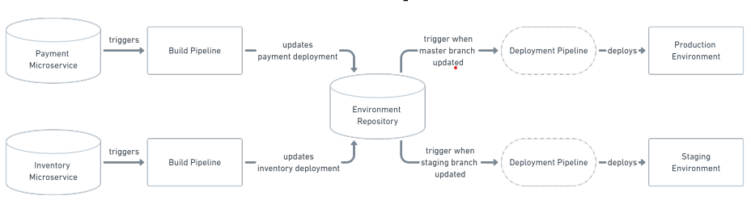

# GitOps

## What is GitOps

GitOps is a way of implementing Continuous Deployment for cloud native applications. It focuses on a developer-centric experience when operating infrastructure, by using tools developers are already familiar with, including Git and Continuous Deployment tools.

The core idea of GitOps is having a Git repository that always contains declarative descriptions of the infrastructure currently desired in the production environment and an automated process to make the production environment match the described state in the repository. If you want to deploy a new application or update an existing one, you only need to update the repository - the automated process handles everything else. It’s like having cruise control for managing your applications in production.

## Why should I use GitOps?

### Deploy Faster More Often

Okay, to be fair, probably every Continuous Deployment technology promises to make deploying faster and allows you to deploy more often. What is unique about GitOps is that you don’t have to switch tools for deploying your application. Everything happens in the version control system you use for developing the application anyways.

When we say “high velocity” we mean that every product team can safely ship updates many times a day — deploy instantly, observe the results in real time, and use this feedback to roll forward or back.

— Weaveworks

### Easy and Fast Error Recovery

Oh no! Your production environment is down! With GitOps you have a complete history of how your environment changed over time. This makes error recovery as easy as issuing a git revert and watching your environment being restored.

The Git record is then not just an audit log but also a transaction log. You can roll back & forth to any snapshot.

— Alexis Richardson