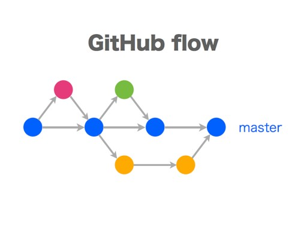

# GitHub Flow

## Description

So, why don't we use git-flow at GitHub? Well, the main issue is that we deploy all the time. The git-flow process is designed largely around the "release". We don't really have "releases" because we deploy to production every day - often several times a day. We can do so through our chat room robot, which is the same place our CI results are displayed. We try to make the process of testing and shipping as simple as possible so that every employee feels comfortable doing it.

There are a number of advantages to deploying so regularly. If you deploy every few hours, it's almost impossible to introduce large numbers of big bugs. Little issues can be introduced, but then they can be fixed and redeployed very quickly. Normally you would have to do a 'hotfix' or something outside of the normal process, but it's simply part of our normal process - there is no difference in the GitHub flow between a hotfix and a very small feature.

Another advantage of deploying all the time is the ability to quickly address issues of all kinds. We can respond to security issues that are brought to our attention or implement small but interesting feature requests incredibly quickly, yet we can use the exact same process to address those changes as we do to handle normal or even large feature development. It's all the same process and it's all very simple.

## How We Do It

So, what is GitHub Flow?

- Anything in the master branch is deployable
- To work on something new, create a descriptively named branch off of master (ie: new-oauth2-scopes)
- Commit to that branch locally and regularly push your work to the same named branch on the server
- When you need feedback or help, or you think the branch is ready for merging, open a pull request
- After someone else has reviewed and signed off on the feature, you can merge it into master
- Once it is merged and pushed to 'master', you can and should deploy immediately